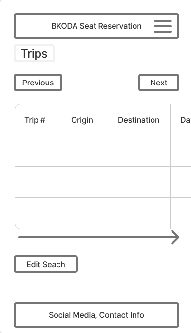

# BKODA Seat Reservation

Live Version: [BKODA Seat Reservation](https://bkoda-seat-reservation-5dffea85a169.herokuapp.com/)

Repository: [GitHub Repo](https://github.com/keelam13/bkoda_seat_reservation)

The app is developed by [Keevin Aroco](https://github.com/keelam13).

## About

[BKODA Seat Reservation](https://bkoda-seat-reservation-5dffea85a169.herokuapp.com/) Bkoda Seat Reservation is a web application built with Django that allows users to easily reserve seats for travels from Kabayan, Benguet to Baguio City and vice versa. It provides a user-friendly interface for trip search, seat reservation and booking management.

## User Experience Design

### Strategy

Developed for the BKODA in the Municipality of Kabayan Benguet in the Philippines. The President of the associatiom wanted an app where clients could easily reserve seats for the trips from Kabayan, Benguet to Baguio City and back. In this locality, the clients usually pay in cash and most of them don't have debit/credit cards. In this case, payment option is going to be a feature for the future improvements of the app. 

The application focuses on simplicity and efficiency, ensuring that users can quickly and easily reserve their desired number of seats. The design prioritizes clear navigation and a straightforward reservation process to minimize user frustration.

### Target Audience

This application is designed for:

* **Passengers:** Individuals seeking to reserve seats for transportation to and from the said areas.
* **Transportation Companies/Administrators:** To manage routes, seat availability, and reservation/bookings.

### User Stories

#### **First Time Visitor Goals**

| Issue ID | User Story |
|-------------|-------------|
|[#6](https://github.com/keelam13/bkoda_seat_reservation/issues/6)|As a Passenger, I want to easily search for available routes and schedules, to be able to decide which trips to take.|
|[#9](https://github.com/keelam13/bkoda_seat_reservation/issues/9)|As a Passenger, I want to view a visual representation of seat availability, or me to check if I can still be accommodated, especially when reserving for multiple passengers.|
|[#3](https://github.com/keelam13/bkoda_seat_reservation/issues/3)|As a Passenger, I want to reserve a seat online, so I don't have to be physically present at the terminal to do so.|
|[#5](https://github.com/keelam13/bkoda_seat_reservation/issues/5)|As a Passenger, I want to view and manage my reservation to cancel or change the number of seats reserved.|
|[#2](https://github.com/keelam13/bkoda_seat_reservation/issues/2)|As a  Passenger,  I want to register an account to be able to see and manage my reservation.|

#### **Frequent Visitor Goals**

| Issue ID    | User Story |
|-------------|-------------|
|[#10](https://github.com/keelam13/bkoda_seat_reservation/issues/10)|As a Frequent Passenger, I want to be able to easily log in to and log out from my account, so that I can have more access to the app's features.|

#### **Administrator Goals**

| Issue ID    | User Story |
|-------------|-------------|
|[#4](https://github.com/keelam13/bkoda_seat_reservation/issues/4)|As an Administrator I want to add scheduled trips and if needed delete them to cater to the demands for transportation.|
|[#1](https://github.com/keelam13/bkoda_seat_reservation/issues/1)|As an Administrator I want to see an overview of the reservations to check if scheduled trips are being booked.|
---

## Technologies used

- ### Languages:
    
    + [Python 3.11.2](https://www.python.org/downloads/release/python-3112/): the primary language used to develop the server-side of the website.
    + [JS](https://www.javascript.com/): the primary language used to develop interactive components of the website.
    + [HTML](https://developer.mozilla.org/en-US/docs/Web/HTML): the markup language used to create the website.
    + [CSS](https://developer.mozilla.org/en-US/docs/Web/css): the styling language used to style the website.

- ### Frameworks and libraries:

    + [Django](https://www.djangoproject.com/): python framework used to create all the logic.
    + [Django-allauth](https://django-allauth.readthedocs.io/en/latest/): the authentication library used to create the user 
    + [Django-crispy-forms](https://django-cryptography.readthedocs.io/en/latest/): was used to control the rendering behavior of Django forms.
    + [Bootstrap](https://getbootstrap.com/):was used to style the page
- ### Databases:

    + [SQLite](https://www.sqlite.org/): was used as a development database.
    + [PostgreSQL](https://www.postgresql.org/): the database used to store all the data.

- ### Other tools:

    + [Git](https://git-scm.com/): the version control system used to manage the code.
    + [Pip3](https://pypi.org/project/pip/): the package manager used to install the dependencies.
    + [Gunicorn](https://gunicorn.org/): the webserver used to run the website.
    + [Spycopg2](https://www.python.org/dev/peps/pep-0249/): the database driver used to connect to the database.
   accounts.
    + [GitHub](https://github.com/): used to host the website's source code.
    + [Heroku](https://heroku.com): used to host the website
    + [VSCode](https://code.visualstudio.com/): the IDE used to develop the website.
    + [Chrome DevTools](https://developer.chrome.com/docs/devtools/open/): was used to debug the website.
    + [Font Awesome](https://fontawesome.com/): was used to create the icons used in the website.
    + [Coolors](https://coolors.co/202a3c-1c2431-181f2a-0b1523-65e2d9-925cef-6b28e0-ffffff-eeeeee) was used to make a color palette for the website.
    * [Figma](https://figma.com/): was used to create the wireframes and the flowchart.
    + [W3C Validator](https://validator.w3.org/): was used to validate HTML5 code for the website.
    + [W3C CSS validator](https://jigsaw.w3.org/css-validator/): was used to validate CSS code for the website.
    + [JShint](https://jshint.com/): was used to validate JS code for the website.
    + [PEP8](https://pep8.org/): was used to validate Python code for the website.

---

## FEATURES

Please refer to the [FEATURES.md](FEATURES.md) file for all features-related documentation.

---

## Design

The design of the application is based on the Material Design principles.

The application's design prioritizes usability and clarity. A clean and modern interface ensures a smooth booking experience for passengers.

### Color Scheme

The color scheme of the application is based on the bold colors:

  

## Color Scheme

The Coder opted to use simple colors using the colors from the Bootstrap Color Class, e.i. Primary (Blue), Danger (Red) and Success (Green).
* **Red:** Used for "Cancel" and "Delete" buttons, indicating actions that require caution.
* **Blue:** Used for the "Update" button, aligning with the overall theme and suggesting a positive action.
* **Green:** Used for the "Previous Day," "Next Day," and "Reserve" buttons. The choice of green is intended to signal positive actions and encourage user engagement. Green is often associated with "go" signals and safe operations, making it suitable for these interactive elements. However, careful consideration was given to ensure sufficient contrast against the light blue background to maintain readability and accessibility.

The application primarily utilizes a light blue (#69DDFF) as the table background, creating a calm and trustworthy interface. 

The application employs black and white texts for primary contents depending on the color contrast between text and background to ensure high readability and clear visibility.

### Typography

The application employs Bootstrap's default font stack to ensure cross-platform compatibility and optimal performance. This stack is designed to utilize fonts that are natively available on the user's operating system, prioritizing `Helvetica Neue`, `Helvetica`, and `Arial`. A generic `sans-serif` font is used as a fallback to guarantee that text is displayed correctly even if the preferred fonts are not present. This strategy minimizes load times and ensures a consistent visual experience for users across different devices and operating systems.

Google font `Lilith One` was also used for the logo to it to stand out a bit from the rest of the texts.

### Imagery

The background image is a shot from the boundary of Kabayan, Benguet's, a scene that resonates with the Kabayan people.

  

* Warm, earthy tones: such as soft browns, beiges, and muted oranges, to evoke a sense of home and comfort.
* Accents of vibrant colors: like the blues of the Philippine flag or the greens of tropical landscapes, to add visual interest and cultural relevance.
* A neutral background: to allow the image to stand out and create a welcoming atmosphere.
* Soft lighting effects: to create a sense of warmth and familiarity.

### Wireframes

## Desktop and Tablets

* Home Display

* Sign Up Form Display

* Logged in Display

* Trip List Display

* Reservation Formm Display

* Reservation List Display

* Reservation Cancelation Display

* Log Out Confirmation Display

## Mobile Devices

* Home Display

* Navbar Dropdown Display

* Trip List Display

* Reservation List Display

---

## Flowcharts

This application is aimed simply for reserving seats for transport.

The flowchart was created to help to understand the application and its functionality.

The flowchart was created using [Figma](https://www.figma.com/).

- [Flowchart for Reservation](documentation/flowchart/flowchart_reservation.png)

---

## Information Architecture

### Database

* During the earliest stages of the project, the database was created using SQLite.
* The database was then migrated to PostgreSQL.

### Entity-Relationship Diagram

## Data Modeling

**Trip**

| Name           | Database Key   | Field Type    | Validation |
| -------------  | -------------  | ------------- | ---------- |
| Trip ID        | trip_id        | AutoField     | primary_key=True    |
| Trip Number    | trip_number    | CharField     | max_length=30, db_index=True    |
| Origin         | origin         | CharField     | max_length=30, db_index=True    |
| Destination    | destination    | CharField     | max_length=30, db_index=True    |
| Date           | date           | DateField     | db_index=True    |
| Time           | time           | TimeField     |   |
| Total Seats    | total_seats    | IntegerField  |   |    
| Available Seats| available_seats| IntegerField  |   |

**Reservation**

| Name           | Database Key   | Field Type    | Validation |
| -------------- | -------------- | ------------- | ---------- |
| User           | user           | ForeignKey    | User, on_delete=models.CASCADE|
| Trip ID        | trip_id (FK)   | ForeignKey    | Trip, on_delete=models.CASCADE|
| Number of Seats| number_of_seats| IntegerField  | default=1  |
| Date           | date           | DateField     |   |
| Time           | time           | TimeField     | null=True, blank=True|

## Relationships

- User to Reservation: One User can have many Reservations (one-to-many). This is represented by the user_id foreign key in the Reservation table.
- Trip to Reservation: One Trip can have many Reservations (one-to-many). This is represented by the trip_id foreign key in the Reservation table.

## Acknowledgments

- The Almighty for the opportunity to do coding.
- My family for their unending support.
- My other half for the love and understanding.
- Cici my girl for the inspiration.
- [Iuliia Konovalova](https://github.com/IuliiaKonovalova) my mentor for the advice, tips and guiding me through the project.
- [Code Institute](https://codeinstitute.net/) lessons, tutors and Slack community members for their support and help.
- [Slack overflow](https://stackoverflow.com/) and [MDN Web Docs](https://developer.mozilla.org/en-US/) for being my run-to references when I have questions. 

